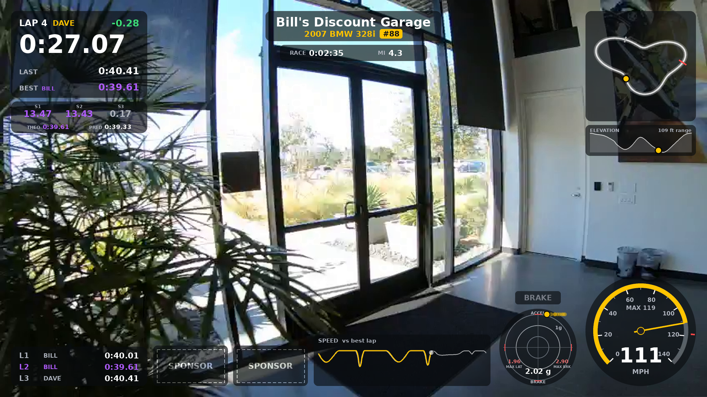

# Racing Telemetry Overlay

Turns GoPro footage of a track session into a video with a lap timer, sector times, speedometer, G-meter, track map and more, using only the GPS and accelerometer data the camera already records. No external logger needed.



Tested with a GoPro Hero 11 Black (GPS on) at Mid-Ohio, on Windows 10/11 with NVIDIA cards and FFmpeg 7-9, and with GoPro's own Hero 5-8 sample files. Other GPS-equipped GoPros (Hero 5 through 11, Max) record the same telemetry and should work; the Hero 12 and 13 have no GPS. Python 3.8+.

## Setup (one time)

1. Install **Python 3.8+** (python.org).
2. Install **FFmpeg** and make sure `ffmpeg` works in a terminal.
   - Mac: `brew install ffmpeg`
   - Windows: `winget install ffmpeg` (then open a new terminal)
3. Install the two Python libraries:
   ```
   pip install numpy pillow
   ```

## Using it

Use the **.MP4** files. The .LRV files are low-res preview copies the camera makes, so you don't need them (see `--use-lrv` below for a use).

**1. Check the laps (takes seconds):**
```
python telemetry_overlay.py GX010123.MP4 --laps-only
```
This prints a lap table and saves a map PNG. With no start/finish line given, it times laps from your top-speed point. Those lap times are still correct, but they're split at the wrong place.

**2. Set the real start/finish line.** Scrub through your video to a moment when the car is crossing the start/finish line *at speed* (any flying lap will do), and pass that time:
```
python telemetry_overlay.py GX010123.MP4 --laps-only --sf-time 19:15
```
Times can be written as seconds (`1155`), `mm:ss` (`19:15`), `h:mm:ss`, or for multi-file sessions as `chapter@time` (`2@0:45` = second file, 45 seconds in). Or use `--sf-point 40.3776,-82.3120` with coordinates from Google Maps.

Don't pick a moment when the car is parked. The tool will tell you the car's speed at the time you chose if it can't find laps.

**3. Preview a single frame** to check the look:
```
python telemetry_overlay.py GX010123.MP4 --sf-time 95.4 --frame 300
```

**4. Render:**
```
python telemetry_overlay.py GX010123.MP4 GX020123.MP4 --sf-time 95.4 --height 1080 --nvidia -o session.mp4
```
A long recording gets split into chapters (GX01…, GX02…). List them in order and they're joined into one video; all times (`--sf-time`, `--green`, `--start`) then count from the start of the first file, or use the `chapter@time` form.

## What you need

Python 3.8 or newer, FFmpeg, and the Python packages `numpy` and `pillow`. The scripts check for these when they start: missing Python packages are offered for install with pip, and on Windows a missing FFmpeg is offered for install with winget (the gyan.dev full build, which includes the GPU filters). `start_ui.bat` also offers to install Python itself if it isn't there.

## The point-and-click way

Double-click `start_ui.bat` (or run `python telemetry_ui.py`). It opens a page in your browser, on this PC only:

1. **Session:** browse to the folder with your GoPro files, pick the recording, and load it. The telemetry is read once and cached next to the videos, so re-opening is instant.
2. **Laps:** scrub the video with the slider (or the arrow keys), and click *Set here* on the start/finish, green flag and checkered moments. Add drivers, or click *Driver change at current time* when you find a pit stop. The lap table updates as you go, and clicking a lap jumps the video to it.
3. **Look:** team, car and number, sponsor logos, which elements to show, gauge settings. The preview on the right shows the overlay on the real footage at the current moment.
4. **Render:** output settings, a *60 s test from here* button, then *Start render* with a progress bar. The equivalent command line is shown, in case you'd rather script it.

Everything is saved in `overlay_project.json` in the video folder, so the next time you open that folder it all comes back.

The black console window is the server: keep it open while rendering. The browser tab can be closed and reopened freely; it reconnects to a render in progress.

## Handy options

| Option | What it does |
|---|---|
| `--start 10:00 --duration 2:00` | Render only part of the video |
| `--use-lrv` | Use the .LRV proxy files for a fast low-res draft |
| `--height 1080` | Output size. Hero 11 records up to 5.3K, which is slow to encode, so 1080 or 2160 is recommended |
| `--nvidia` | Decode and encode on an NVIDIA graphics card (much faster) |
| `--cq 19` | Quality in `--nvidia` mode (lower = better and bigger file) |
| `--jobs 8` | How many CPU processes draw the overlay (default: about half your CPU threads). More is faster until FFmpeg becomes the limit |
| `--gpu-filters auto` | With `--nvidia`, also do the scaling and compositing on the graphics card if your FFmpeg build has `scale_cuda`/`overlay_cuda` (`on`/`off` to force) |
| `--overlay-format yuva420p` | How overlay frames are sent to FFmpeg. The default is smaller and faster than `rgba` |
| `--feed tcp` | Overlay frames go to FFmpeg over a local socket (default; much faster than `pipe` on Windows) |
| `--overlay-fps 15` | Redraw the overlay 15 times a second instead of 30. Halves the drawing work; the video itself keeps its full frame rate |
| `--vcodec h264_videotoolbox` | Hardware encoding on a Mac |
| `--hide trace,elev` | Leave out overlay elements (list in 'What's on screen') |
| `--scale 0.85` | Make all overlay elements smaller (or larger) |
| `--sectors 3` | Sectors per lap (1 = off) |
| `--g-max 1.5` | G-meter full scale |
| `--brake-g 0.5` | Deceleration that lights the BRAKE lamp |
| `--g-peaks lap` | Peak markers on the G-meter: `lap` (reset each lap), `session`, or `off` |
| `--team "Bill's Discount Garage" --car "2007 BMW 328i" --number 88` | Team name, car and car-number badge in a panel across the top, above the clock strip |
| `--logo team.png` | Team logo across the top, above the clock strip (PNG with transparency looks best). `--logo-height 100` makes it bigger |
| `--sponsor a.png --sponsor b.png` | Sponsor logos in slots along the bottom, between the speed trace and the G-meter |
| `--sponsor-slots 3` | Show this many slots; ones without an image are drawn as dashed SPONSOR placeholders |
| `--tz -4` | Clock time zone offset in hours (default: the PC's own zone) |
| `--kmh` | km/h instead of MPH |
| `--speed-max 140` | Fix the speedo's top value |
| `--sf-width 20` | Narrow the timing line if the pit lane runs right next to it |
| `--green 19:00` | Race start time. Line crossings before it don't count, so pace laps under caution aren't timed (the overlay shows PACE LAP until the first crossing after it) |
| `--driver Chris --driver Dave@lap38` | Driver names per stint. The first needs no `@when`; later ones take over at a lap number (`@lap38`) or a video moment (`@3@12:40` = file 3, 12:40 in). Each lap is credited to whoever was in the car when it started, and the best lap shows who set it |
| `--checkered 2@31:10` | Time you take the checkered flag. The cool-down lap isn't timed, and the overlay shows the final result |
| `--start 18:45` | Begin the output video here, e.g. shortly before the green flag |
| `--min-lap 45` | Ignore crossings closer together than this (prevents false laps) |
| `--gps-offset 0.2` | Nudge GPS timing if the overlay seems early or late |
| `--dump-telemetry gps.csv` | Export the raw GPS |
| `--telemetry-csv file.csv` | Use GPS from another logger (columns `t,lat,lon,speed`, where `t` is seconds from video start and `speed` is in m/s) |

## Making it faster

The overlay is drawn by several CPU processes in parallel and handed to FFmpeg, which (with `--nvidia`) decodes and encodes on the graphics card. The progress line shows the speed as a multiple of realtime. If it's slower than you'd like:

1. Make sure `--nvidia` is on and `--height 1080` is set (5.3K output is many times more work).
2. Try more workers, e.g. `--jobs 12`. If that doesn't help, FFmpeg is the bottleneck, not the drawing.
3. Check whether the "Rendering ..." line says "GPU filters". If it doesn't, your FFmpeg build can't scale/composite on the GPU; the full builds from gyan.dev or BtbN can.
4. `--overlay-fps 15` halves the drawing work with little visible difference.

To see exactly where the time goes, add `--bench` to a render command (with a short `--duration`). It times the drawing, the worker pool, and FFmpeg on its own, and prints which one is the bottleneck.

## What's on screen

- **Top left, lap panel:** lap number, current driver, running lap time, LAST and BEST lap (with who set it), and a live delta to the best lap (green = ahead, red = behind). When you cross the line, the finished lap time holds for 3 seconds, purple if it's a new best.
- **Sector strip:** three sector times for the lap in progress, coloured like an F1 broadcast: purple = fastest anyone has done that sector this session, green = the current driver's personal best, yellow = slower than their personal best, grey = still running. Below them: **THEO**, the theoretical best lap (best sectors added up), and **PRED**, the lap time you're on pace for.
- **Bottom left, lap history:** recent laps with driver and time, the best in purple.
- **Top centre:** your team name and car (`--team`, `--car`) or a logo image (`--logo`), then the race clock (from `--green`), distance covered, and time of day from the GPS clock.
- **Bottom centre:** sponsor logo slots (`--sponsor`, `--sponsor-slots`), then the speed trace next to the G-meter.
- **NEW BEST LAP banner:** appears for 5 seconds whenever the best lap is beaten, naming the driver and the gain.
- **Top right, map:** the track with your position (yellow), the start/finish line (red), sector lines (white) and a faded **ghost** dot showing where the best lap was at this point.
- **Elevation:** the track's height profile for the best lap with your position on it.
- **Bottom right, speedo:** with a red tick and MAX readout for the top speed so far.
- **G-meter:** lateral and longitudinal g from the camera's accelerometer, rings at 0.5 g steps, with a short trail. The camera's orientation is worked out automatically from gravity and the GPS, and the run prints how well the two agree. If they don't, it falls back to GPS-derived g. Red ticks on the axes mark the peak left/right cornering, braking and acceleration g of the current lap, and the MAX LAT / MAX BRK numbers show the biggest of them (`--g-peaks session` keeps peaks for the whole race, `off` hides them). The **BRAKE** light comes on above 0.5 g of deceleration (`--brake-g` to change).
- **Speed trace** (left of the G-meter): this lap's speed (yellow) drawn over the best lap's (white), against distance around the lap.

Too busy? Leave things out with `--hide`, e.g. `--hide trace,elev,ghost`. Elements: `laps, list, sectors, theo, pred, clock, map, ghost, elev, speedo, max, gmeter, brake, trace, banner, driver`. Shrink or grow everything with `--scale 0.85`.

Also written: `<name>_laps.csv` with every lap time, its driver, sector times, peak lateral / braking / acceleration g, and where each lap starts in the video (in seconds, mm:ss, and file@time). In the printed table, laps much longer than usual are marked `(long)` so pit stops are easy to spot.

## Hero 11 notes

- GPS must be turned **on** in the camera's preferences, and the camera needs a clear sky view to lock. Power it on outside a few minutes before your session.
- The Hero 11's GPS updates about 10 times per second. Lap times are interpolated to the exact moment you cross the line, so they're accurate to roughly ±0.05 s. That's great for comparing your own laps, but not a replacement for official transponder timing.
